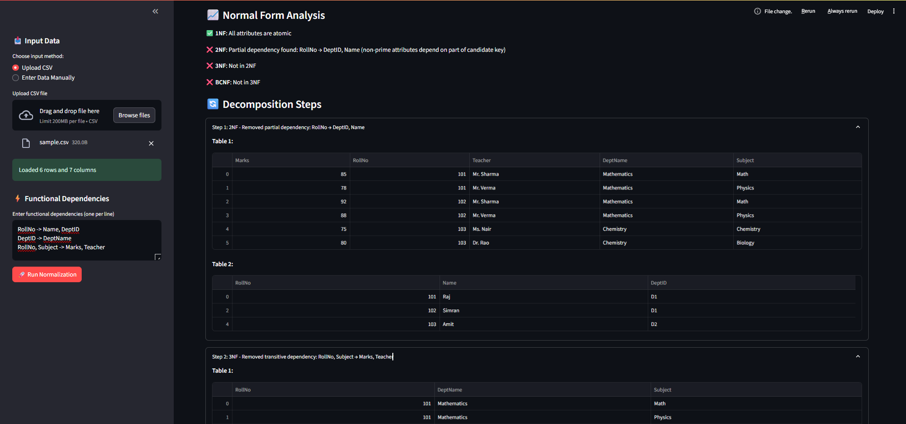
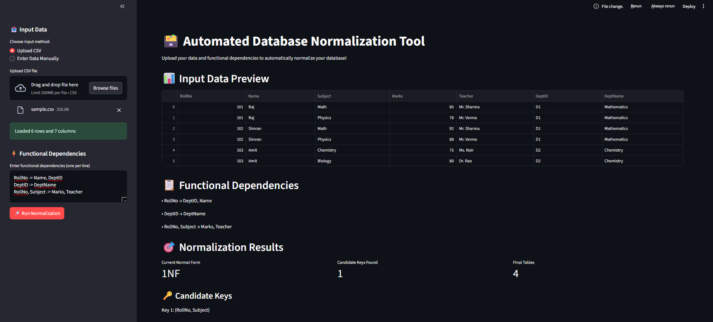

# Database Normalization Tool

## 📋 Overview
The Database Normalization Tool is an interactive web application that automates the process of database normalization. It helps database designers and students understand and apply normalization principles to transform unnormalized database schemas into well-structured, normalized designs that follow 1NF, 2NF, 3NF, and BCNF rules.

## ✨ Features

- **Data Input Flexibility**: Upload CSV files or manually enter data
- **Functional Dependency Analysis**: Define and analyze functional dependencies
- **Automatic Normal Form Detection**: Identifies the current normal form of your data
- **Step-by-Step Normalization**: Automatically decomposes tables to achieve higher normal forms
- **Candidate Key Detection**: Identifies all candidate keys in your relations
- **Detailed Explanations**: Provides reasons for normalization decisions
- **ER Diagram Visualization**: Generates entity-relationship diagrams for normalized schemas
- **Comprehensive Export Options**:
  - SQL scripts (CREATE TABLE and INSERT statements)
  - CSV files for all normalized tables
  - ER diagrams in PNG and SVG formats

## 🚀 Installation

### Prerequisites
- Python 3.7 or higher
- pip (Python package manager)

### Setup

1. Clone this repository or download the source code

2. Install the required dependencies:

```bash
pip install streamlit pandas graphviz
```

3. Run the application:

```bash
streamlit run normalization.py
```

## 🔍 How to Use

1. **Input Data**:
   - Upload a CSV file containing your database table
   - Or manually enter data by specifying columns and rows

2. **Define Functional Dependencies**:
   - Enter functional dependencies in the format: `A, B -> C, D`
   - Each line represents one functional dependency

3. **Run Normalization**:
   - Click the "Run Normalization" button to start the process

4. **Explore Results**:
   - View the current normal form of your data
   - Examine candidate keys
   - Review the step-by-step decomposition process
   - Visualize the final normalized tables and ER diagram

5. **Export Results**:
   - Download SQL scripts for creating the normalized database
   - Export normalized tables as CSV files
   - Save ER diagrams in PNG or SVG format

## 🧩 Technical Details

### Components

- **FunctionDependency**: Represents functional dependencies between attributes
- **InputParser**: Handles parsing of functional dependencies and data validation
- **FDProcessor**: Implements closure algorithms and candidate key detection
- **NormalFormDetector**: Analyzes relations to determine their normal form
- **DatabaseDecomposer**: Performs the actual normalization and decomposition
- **ERDiagramVisualizer**: Generates graphical representations of database schemas
- **SQLExporter**: Creates SQL scripts for the normalized database

### Normalization Process

1. **1NF**: Ensures all attributes contain atomic values
2. **2NF**: Removes partial dependencies on candidate keys
3. **3NF**: Eliminates transitive dependencies
4. **BCNF**: Ensures all determinants are superkeys

## 📝 Sample Data

The repository includes a sample.csv file that demonstrates the expected format for input data. You can use this as a template for your own datasets.

## 📸 Screenshots

### Home Page


### Another Screenshot



## 🤝 Contributing

Contributions are welcome! Feel free to submit issues or pull requests if you have suggestions for improvements or bug fixes.

